# 04 — Information Architecture & Sitemap

**Author**: Agent 4 — Senior UX/UI Designer & Information Architect
**Status**: Draft v1. Binding for Agents 5–10.
**Supersedes**: nothing. **Superseded by**: `phase-1-revisions.md` where they conflict.
**Anchored to**:
- Dossier (four clusters, North Star, hosting constraints).
- Phase-1 revisions (four clusters only, no markets, GH Pages + Astro, transitions are first-class, IA is planning-under-uncertainty spine).
- Agent 1 positioning ("planning-under-uncertainty spine is the thing that holds everything together").
- Agent 2's seven-beat narrative arc on the landing page — **not to be re-architected here**, only supported.
- Agent 3's visual motifs (SLAM map, behavior-tree nav, belief-state loader, uncertainty ellipses, 4D lattice grid).

---

## 0. What this document decides

Six things, in order: (1) the IA model; (2) the page-by-page component inventory; (3) the navigation system; (4) URL structure and bilingual routing; (5) SEO metadata rules; (6) CV handling. A Mermaid sitemap closes the document.

Every page that appears below has to justify its existence in one sentence. If a page cannot, it is cut here, not in Agent 9's build.

---

## 1. The IA decision

### 1.1 Two candidates considered

#### Option A — Scroll-narrative + a handful of deep pages ("the manifesto with footnotes")

A long-form, single-scroll `/` (the seven-beat arc, landed by Agent 2) carries the positioning, the four clusters, the flagship proof, and the invitation. Deep pages exist only where a long scroll cannot serve the content type: work detail (per-project), writing (index + post), about, contact, legal. Clusters have *in-page* sections on `/` and do **not** get their own routes. A visitor who lands on `/` and scrolls all seven beats has "read the site."

- **Strengths**: serves Agent 2's arc natively; makes the seven beats load-bearing; minimises surface area; URL map stays small, which is friendly to GH Pages and to translation; route-level "replan" transitions become rare and therefore meaningful; perfectly matches the "site as running process" North Star.
- **Weaknesses**: cluster-specific deep-linking is weaker (a recruiter wanting to send a link to "Planning & Decision" can only anchor-link); long-form `/` compresses every cluster to ~70 words forever, capping editorial depth; an expert collaborator has nowhere to geek out on one cluster.

#### Option B — Hub-and-spokes (4-cluster top-nav)

A short `/` (hero + thesis + four cluster entry tiles + projects strip + latest writing + contact) acts as a hub. Each of the four clusters is its own route with its own long page. Projects and writing also sit at their own routes.

- **Strengths**: cluster deep-linking; editorial runway for each cluster; cleaner information scent for recruiters scanning for a specific area.
- **Weaknesses**: explicitly the thing Phase-1 revisions rejected ("not 5-cluster flat nav; pin the planning-under-uncertainty spine"). Four equal cluster routes flattens the story into parallel categories — exactly the failure mode Agent 1 warned against. Also loses the "running process" feel: a hub is a static table of contents, not a belief state converging.

### 1.2 Recommendation — **Option A, scroll-narrative hybrid**

Three reasons, each tied directly to the pinned constraints:

- **The planning-under-uncertainty spine is a *throughline*, not a *taxonomy*.** A hub-and-spokes IA forces the spine to live in a sidebar banner; a scroll-narrative IA lets the spine be the shape of the scroll itself — orientation → perception → planning-under-uncertainty → human model → systems → frontier → invitation. The scroll *is* the planner's chain of reasoning, rendered as a page. This is what it means to pin the spine in IA instead of in copy only.
- **Transitions as first-class survive only if routes are rare.** The revisions elevate route-level transitions to "a replan" and section-level transitions to "a sensor handoff." If we ship a hub-and-spokes, *every* click becomes a replan — the metaphor inflates into wallpaper. Option A keeps route transitions scarce (home ↔ work detail, home ↔ writing, home ↔ about, home ↔ contact) so each one earns its narrative weight. Section handoffs inside `/` do the heavy lifting at 4× the frequency.
- **GH Pages + Astro rewards fewer, denser routes.** No middleware means every route is a physical file we must ship in two languages; editorial cost compounds. A small, deliberate route map (≈8 routes × 2 locales) is maintainable; a cluster-per-page sprawl (≈16+ routes × 2 locales) is not, and shipping half-empty cluster pages violates the "no routes for completeness" guardrail.

### 1.3 The hybrid shape — what Option A actually is

- **`/` (home)** carries the full seven-beat arc. Clusters appear as *panels within the scroll*, not as routes. Each cluster panel anchors at `#perception`, `#planning`, `#human`, `#systems` for deep-linking without a route.
- **`/work/`** is a single page listing the five flagship projects in expanded form. Each project is a section on the page with its own anchor (`/work/#robotclaw`, `/work/#noovelia-lattice`, etc.), not a sub-route. One page, five deep cards. Justification for not giving each project its own route: at five projects, the editorial ratio (≈150–300 words + 1–3 assets each) is too thin for five separate pages; a single long `/work/` gives them the context of each other, which is the real value. If a project outgrows a section (e.g., RobotClaw post-launch gets a full case study), we promote it to `/work/robotclaw/` at that point — not preemptively.
- **`/writing/`** appears only when there is at least one published note. It is a reverse-chronological index with tag filters. Individual posts live at `/writing/<slug>/`. The guardrail: no empty blog index. If there are zero posts at launch, `/writing/` does not exist and the homepage "Signal" beat degrades gracefully to a "writing is coming" line that does not link anywhere.
- **`/about/`** exists because Cyrille-the-person (one portrait, CV download, short bio, education) does not belong inside the seven-beat manifesto — mixing biography into the arc dilutes the thesis.
- **`/contact/`** exists only if the contact form needs a dedicated surface. Default is to fold contact into the closing beat of `/` and the footer; if Formspree is wired, `/contact/` can be the form page proper. **Decision: fold contact into `/` bottom + footer; no `/contact/` route.** One less page to translate, and the invitation belongs inside the arc.
- **`/404`** and **`/legal/`** (privacy notice, if we ship Plausible) round out the map.

That is the hybrid: one narrative home, four functional deep pages, one utility. No cluster routes. No markets anywhere.

---

## 2. Page-by-page component inventory

This is the contract for Agents 5 (engineering), 6 (motion), 7 (bilingual content ops if spun up), 8 (SEO/meta), 9 (deploy), 10 (wherever transitions land). Every component here is a named, addressable unit.

### 2.1 `/` — Home (seven-beat scroll)

**Justifies its existence**: it is the site; every other page is a footnote to it.

**Scroll budget**: 7 beats × ~1 viewport each on desktop = 7 screens. This breaks the 4-screen guardrail and is defended: the seven-beat arc is Agent 2's load-bearing design; compressing beats destroys it; expanding beats is what turns the site from a portfolio into an instrument. This is the one page allowed to exceed the scroll budget.

**Sections / components (in scroll order, mapped to Agent 2's beats):**

1. **Beat 1 — Hero / "Sensors Initializing"**
   - `HeroCanvas` (Agent 3 Concept 1): WebGL2 point-cloud wake-up; canvas2D fallback; static-resolved fallback for `prefers-reduced-motion`.
   - `HeroHeadline` (Agent 2's 14-word hero).
   - `EyebrowMarker` (`§ 00 / BOOTING PERCEPTION` — mono micro).
   - `BeliefStateLoader` inline under the headline, sharpens over ~1.8s.
   - `LanguageToggle` (top-right; see §4).
   - `PrimaryNav` (behavior-tree motif; see §3).
   - Interaction: on mouse-move, points within a radius reorient (Agent 3). On scroll past 40% viewport, handoff animation fires (sensor handoff from Beat 1 to Beat 2).

2. **Beat 2 — Orientation / "What I'm building"**
   - `OrientationBlock` (Agent 2's 81-word paragraph).
   - `EyebrowMarker` (`§ 01 / ORIENTATION`).
   - `ProofStrip`: three inline data points (mono) — "Noovelia — AGV autonomy", "Odu — sidewalk SLAM", "RobotClaw — local-first AI".
   - No CTA. Orientation ends, proof follows.

3. **Beat 3 — Proof / Flagship projects strip**
   - `EyebrowMarker` (`§ 02 / SHIPS BEFORE SLIDES`).
   - `ProjectCardGrid`: 5 cards (RobotClaw, OpenClaw, Drone stack, Noovelia lattice, Odu SLAM). Agent 2's ≤40-word copy per card.
     - Each card: title, 3-line body (what/taught/next), `UncertaintyEllipseBadge` (the cluster this project maps to), status pill (shipped / in production / private / open-source soon), optional repo link (`Open the repo`).
     - Hover: component-level "belief convergence" — ellipse tightens.
   - `CTALink` at the strip foot: `See the work →` → `/work/`.
   - Mobile: horizontal scroll-snap carousel of cards; no masonry.

4. **Beat 4 — Depth / Four cluster panels**
   - Four `ClusterPanel` sections, in order: Perception, Planning, Human, Systems.
   - Each panel:
     - `EyebrowMarker` (`§ 03 / PERCEPTION & SPATIAL INTELLIGENCE`, etc.).
     - `ClusterEllipseSigil` at 240px (Agent 3).
     - Agent 2's ~70-word paragraph.
     - Data artifact: a real SLAM export, planner frame, RobotClaw belief trace, or ROS graph — one per panel. **Asset request to Cyrille** flagged (see §8).
     - `ClusterAnchorId` for deep-linking: `#perception`, `#planning`, `#human`, `#systems`.
     - Inter-panel transition: **section-level sensor handoff**. Named metaphors: `perception→planning` = "map handed to planner"; `planning→human` = "world model meets intent model"; `human→systems` = "intent pushed onto the bus."
   - This beat is 4 sub-sections — do not make them 4 viewports each. Each cluster panel is ~0.8 viewport on desktop, so the whole Depth beat consumes ~3.2 viewports. Acceptable inside the 7-beat defense.

5. **Beat 5 — Frontier / "What I'm pulling in"**
   - `EyebrowMarker` (`§ 04 / FRONTIER`).
   - `FrontierBridgesGrid`: 8–10 small chips (neuroscience of decision-making, causal inference, model-based RL, nonlinear control, affective computing, event-driven architectures, information theory, HCI, probabilistic programming). Dossier lists these; we drop "market microstructure" per the no-markets rule.
   - Each chip is a `ConceptChip` with a short (≤15-word) one-liner on hover/focus stating how Cyrille is pulling it into his work.
   - No outbound links on chips — these are admitted influences, not papers. A link would promise a reading list we do not ship.

6. **Beat 6 — Signal / Writing teaser**
   - `EyebrowMarker` (`§ 05 / SIGNAL`).
   - **Conditional**: rendered only if `/writing/` has ≥1 post. If zero posts: a one-line `EmptyStateNote` (Agent 2 micro-copy 20 adapted: "I write slowly on purpose — notes coming.") with **no link**.
   - When populated: `WritingPreviewList` of the 3 most recent posts (title + date in mono + 1-sentence dek). `CTALink`: `Read the notes →` → `/writing/`.

7. **Beat 7 — Invitation / Contact**
   - `EyebrowMarker` (`§ 06 / WRITE TO ME`).
   - `ClosingInvitationBlock` (Agent 2's 39-word closing).
   - `ContactForm` (Formspree-backed) OR `MailtoButton` if Formspree not available at build time. Fields per Agent 2 micro-copy 7–16.
   - `FooterBlock` below (see §3.3).

**Route-level transition out**: if the user navigates to `/work/`, `/writing/`, `/about/`, we render the replan animation (Agent 3's responsibility; Agent 10 implements). Lattice expansion from the clicked anchor to the new route's hero.

### 2.2 `/work/` — Flagship projects (expanded)

**Justifies its existence**: recruiters and collaborators need a page they can share and skim that lists Cyrille's shipped systems with enough technical depth to be worth the click — the homepage proof strip is ≤40 words per card and that is not enough for "I need to talk to him this week."

**Scroll budget**: 1 intro + 5 project sections ≈ 3.5 screens. Within budget.

**Sections / components:**

- `PageHeader` with `EyebrowMarker` (`§ 07 / WORK`), H1 ("Work"), 2-sentence dek ("Five systems that exist in the physical world. Each one taught me something that could not be read.").
- `ProjectTableOfContents` (sticky, mono micro, anchors to each section). Hidden on mobile behind a collapsible summary.
- `ProjectSection` × 5 (anchors: `#robotclaw`, `#openclaw`, `#drone-stack`, `#noovelia-lattice`, `#odu-slam`). Each section:
  - `ProjectHeader`: project name, status pill, cluster ellipse badge(s), stack chips (mono micro).
  - `ProjectAsset`: one hero data asset (SLAM map, planner frame, POMDP trace, architecture diagram, field photo — non-stock).
  - `ProjectBody`: 150–300 words structured as *what it does · what it taught me · what's next* (extending Agent 2's 40-word card, not contradicting it).
  - `ProjectLinks`: repo link, live demo link, writeup link (each only if it exists; never placeholder-linked).
  - `RelatedCluster`: a single line pointing to the relevant cluster anchor on `/` (e.g., "Related: Planning & Decision → /#planning").
- `FooterBlock`.

**Component interactions**: each `ProjectSection` uses `BeliefStateLoader` when a heavy asset (e.g., interactive SLAM viewer) is still fetching. Hover on `ProjectHeader` tightens the cluster ellipse.

### 2.3 `/writing/` — Notes index

**Justifies its existence**: long-form writing is Agent 1's "builder who writes" and Agent 2's "Signal" beat's promise; an indexable writing home is how a builder earns the "writes" half. **Route only exists if ≥1 post is published.**

**Scroll budget**: 1 intro + list. Capped at 1 screen until ~15 posts, then paginated. Within budget.

**Sections / components:**

- `PageHeader` (`§ 08 / WRITING`, H1 "Writing", 1-sentence dek).
- `WritingFilter` (tag chips — tags from post frontmatter; e.g., `belief-state`, `planning`, `slam`, `field-notes`, `hn-thread`). Static-filtered via URL hash, no JS-only dependency.
- `WritingList`: reverse-chrono entries. Each entry: date (mono micro), title (H3), 2-line dek, tag chips, estimated reading time (mono micro). Entry row links to `/writing/<slug>/`.
- `RSSLink` in the header: `/rss.xml` (Astro content collections can emit this at build time).
- `FooterBlock`.

**Empty state**: route does not exist. Do not ship an empty index.

### 2.4 `/writing/<slug>/` — Individual post

**Justifies its existence**: the MDX artifact itself is the point; every post is an artifact.

**Scroll budget**: content-dependent. Not counted against the guardrail — long-form essays are allowed to be long, and `t-reading` (Agent 3's 18/30 Inter) is designed for it.

**Sections / components:**

- `PostHeader`: eyebrow with `§ WRITING /` and post number, H1 title, date, estimated reading time, tags, language alternate link (FR version, if translated).
- `PostBody`: MDX. Available components in MDX scope:
  - `Callout` (info / warning / aside variants).
  - `CodeBlock` with syntax highlighting and copy button.
  - `Figure` with caption and `data-source` attribute (Agent 3 §5.1 rule).
  - `Footnote` / `FootnoteRef` (sidenote-style on desktop, inline on mobile).
  - `BeliefDistribution`, `LatticeFrame`, `PointCloudEmbed` — optional visualization components if the post is technical enough to warrant them. These are React islands.
- `PostFooter`: author line (just "Cyrille Tabe, Montréal, <date>"), tags repeated, `PrevNextPostNav`, "Reply by email" mailto with pre-filled subject.
- `FooterBlock`.

### 2.5 `/about/` — About

**Justifies its existence**: the one page where Cyrille-the-person belongs — portrait, education, CV download, short bio — kept out of the manifesto `/` so the manifesto stays load-bearing.

**Scroll budget**: ~2 screens. Within budget.

**Sections / components:**

- `PageHeader` (`§ 09 / ABOUT`, H1 "About", 1-line dek).
- `PortraitBlock`: Agent 3's single warm-monochrome portrait. Right column on desktop, top on mobile.
- `BioBlock`: ~150–200 words, first-person, picking up Agent 2's voice. Covers: who Cyrille is, where he works (Noovelia, Odu), education (M.Eng. Poly Montréal), languages (FR/EN), city (Montréal).
- `TimelineBlock`: tight vertical timeline with 6–10 rows, mono micro dates. Rows: education, current roles, flagship project starts, open-source milestones. Not a résumé rehash — a compressed career shape.
- `CVDownloadBlock`: **single primary action** — `Download CV (PDF, 2 pages, EN)` and `Télécharger le CV (PDF, 2 pages, FR)`. Byte-size and last-updated date in mono micro. See §6.
- `NowBlock` (optional, cheap): a 3-line "Now" panel ("what I'm working on this month"), updated via MDX frontmatter on the About page source. If Cyrille does not want to maintain it, it gets cut — empty Now is worse than no Now.
- `FooterBlock`.

### 2.6 Footer (global)

Appears on every page. Not a route; a component.

- `FooterNav`: links to `/`, `/work/`, `/writing/` (conditional), `/about/`, `/#contact`.
- `FooterMeta`: copyright line (mono micro), "Built on Astro, hosted on GitHub Pages, self-hosted everything." (local-first signal), last deploy date in mono micro (from build env).
- `FooterLanguageToggle` (mirrors header toggle).
- `FooterSocials`: GitHub, X/Mastodon, LinkedIn, email. Icons per Agent 3 §7 (antenna for email, not envelope).
- `FooterRSSLink` (if `/writing/` exists).
- `FooterLegalLink` to `/legal/` (if Plausible is used).

### 2.7 `/legal/` — Privacy / analytics notice

**Justifies its existence**: only exists if we ship Plausible. If we ship zero analytics, this page is cut. A short page (≤400 words) stating: no cookies, no third parties, Plausible cloud receives aggregate counts only, no fingerprinting.

### 2.8 `/404` — Not found

**Justifies its existence**: a 404 is load-bearing on a static site; GH Pages serves a custom one if named `404.html`.

**Sections / components:**

- `NotFoundBlock` with Agent 2 micro-copy 23.
- `NavBackToHome`.
- Lightweight version of the `HeroCanvas` (static, low-density) so the 404 still *feels* like the site.

---

## 3. Navigation system

### 3.1 Primary navigation — the behavior-tree motif

Agent 3 proposed a behavior-tree motif for the primary nav. I am **accepting** it with scope adjustments so it serves the planning-under-uncertainty spine rather than fighting it.

**Why it works for this IA:**

- The BT nav *is* the spine visualized. A behavior tree is literally the control structure Cyrille ships on Noovelia AGVs. Showing the site's navigation as a BT says "this site is organized the way my robots are organized."
- Option A IA has only a handful of leaves (home, work, writing, about — four leaves). Agent 3's Open Question #2 ("BT nav degrades at 20+ endpoints") is answered: we have 4. Well within BT-friendly scope.
- The *current route* is the "ticked" action node. A replan transition between routes becomes the tick propagating from root to a new leaf — nav animation and route-transition metaphor are one and the same. This is where IA and motion fuse, and it is the highest-leverage decision in the document.

**Scope adjustments to Agent 3's proposal:**

- **Leaves are routes, not cluster panels.** Cluster deep-links (`#perception` etc.) do *not* appear as BT leaves — they would inflate the tree and invite the hub-and-spokes failure mode. Clusters are anchors inside `/`, reachable via a secondary nav.
- **Root node is always `site/`**; first-level children are a sequence: `home → work → writing → about`. Writing is hidden if there are no posts (the leaf is pruned, not greyed — a BT without a `writing` action is honest about state).
- **Mobile fallback**: below 768px, the BT collapses to a standard labeled list in a drawer — Agent 3 already anticipated this. The BT motif reappears as a small static sigil in the drawer header, so the metaphor is still present.
- **Contact is not a BT leaf.** It lives at `/#contact` (anchor on home). The BT does not need a stub for "open email" — a behavior tree ending in email-compose is misuse of the metaphor.

**Nav component contract (for Agent 5):**

- `PrimaryNav` component, top-left desktop, drawer mobile.
- Data: a static JSON of `{ root, leaves: [{ slug, labelEn, labelFr, visible(siteState) }] }`. `visible` is a pure function so no runtime data-fetching is needed — fully static.
- Active leaf: `--primary` amber glow at 60% alpha + 2px outer ring (Agent 3).
- Transition on click: tick propagates root→leaf in 400ms `ease-out-quart`, *then* the route replan fires. Total handoff ≤ 1.2s. Reduced-motion fallback: static tick at destination with 120ms fade.

### 3.2 Secondary navigation — contextual, per-page

Not every page needs secondary nav. Specifically:

- **On `/`**: a right-side (desktop) / bottom-pinned (mobile) `ScrollProgress` component rendering as a *belief-state distribution over the 7 beats* — the tallest bar is the beat currently in viewport. Click a bar → smooth-scroll to that beat with a mini sensor-handoff. This is the "where am I in the manifesto" affordance, and it is the only place cluster deep-links appear (at Beat 4, the component subdivides into `perception/planning/human/systems` sub-bars).
- **On `/work/`**: a `ProjectTableOfContents` (see §2.2). Sticky on desktop, collapsible on mobile.
- **On `/writing/`**: tag filter chips act as secondary nav.
- **On `/writing/<slug>/`**: a `ReadingProgress` indicator (thin top bar), `PrevNextPostNav` at foot.
- **On `/about/`**: none. Page is short enough.

### 3.3 Footer

Global, per §2.6. The footer intentionally duplicates the primary nav (lower-stakes, text-only) so keyboard users and screen-reader users have a linear fallback to the BT nav — **accessibility contract, non-negotiable**.

### 3.4 Persistent vs contextual

- **Persistent on every route**: `PrimaryNav`, `LanguageToggle`, `FooterBlock`.
- **Contextual**: `ScrollProgress` on `/`, `ProjectTableOfContents` on `/work/`, `ReadingProgress` on `/writing/<slug>/`, tag filter on `/writing/`.

### 3.5 How the nav embodies the planning-under-uncertainty spine — one paragraph

The primary nav is a behavior tree — the same control structure Cyrille writes for AGVs. Clicking a leaf ticks the tree from root to the new action, and then the site replans (Agent 3's route transition) to reach the new state. The `ScrollProgress` on the homepage is not a scrollbar — it is a belief distribution over the seven beats, re-normalised as the visitor moves. Deep-linking into a cluster is an *observation* that sharpens that distribution. The nav is the spine, not an ornament attached to it.

---

## 4. URL structure & bilingual routing

### 4.1 Static routing, no middleware

Per Phase-1 revisions, i18n is static-routing only: `/` for EN (default), `/fr/` for FR. No dynamic middleware, no Accept-Language redirect (that would require a server). On first visit we render EN; a one-time client-side script *may* render a dismissable banner ("Français disponible →") if `navigator.language` starts with `fr`, but the user still explicitly chooses — no auto-redirect. This keeps the site fully functional with JS disabled.

### 4.2 Full route map

| English | French | Justification |
|---|---|---|
| `/` | `/fr/` | Home; seven-beat scroll; the site. |
| `/work/` | `/fr/travaux/` | Flagship projects, expanded. |
| `/work/#robotclaw`, `#openclaw`, `#drone-stack`, `#noovelia-lattice`, `#odu-slam` | `/fr/travaux/#robotclaw`, etc. | Project anchors. Slugs stay English in FR for stable sharing — they are project names, not translatable. |
| `/writing/` | `/fr/ecrits/` | Writing index; conditional on ≥1 post. |
| `/writing/<slug>/` | `/fr/ecrits/<slug-fr>/` | Individual post. Slugs *are* translated — posts in FR get FR slugs so the URL reads as FR. Untranslated posts are served only at the EN path; the FR route returns 404 with a "pas encore traduit" note. |
| `/about/` | `/fr/a-propos/` | About. |
| `/legal/` | `/fr/mentions-legales/` | Privacy notice; conditional on analytics. |
| `/404` | `/fr/404` | Custom 404. Astro emits both. |
| `/rss.xml` | `/fr/rss.xml` | One feed per language; titles and deks in the feed locale. Conditional on `/writing/`. |
| `/sitemap-index.xml` | — | Single canonical sitemap at root, lists both-locale routes. |
| `/robots.txt` | — | Root only. |
| `/cv-cyrille-tabe-en.pdf` | `/cv-cyrille-tabe-fr.pdf` | Static-hosted PDFs (see §6). Not under a locale prefix — they are assets, not pages. |

Home anchors inside `/`: `#orientation`, `#proof`, `#perception`, `#planning`, `#human`, `#systems`, `#frontier`, `#signal`, `#contact`. Same anchor slugs on `/fr/` — the fragment is not translated (this is a deliberate trade-off: FR-native users see an EN anchor in their URL, but every link stays valid if the visitor language-switches mid-scroll, and every external share works across locales).

### 4.3 Canonical rules

- Each page has a `<link rel="canonical" href="{absolute-url}">` pointing to its own absolute URL in its own locale. FR pages are not canonical to EN (they are translations, not duplicates).
- Trailing slash: **always present** on pretty URLs (`/work/` not `/work`). Astro's `build.format: 'directory'` handles this; Agent 9 configures it.
- `http://` and the `www.` subdomain (if it ever exists) 301 to the canonical `https://` bare host. Handled at GitHub Pages / CNAME level where possible; otherwise via a meta refresh on the `www` entry.

### 4.4 `hreflang`

Every page emits:

```html
<link rel="alternate" hreflang="en" href="https://cyrilletabe.com/work/">
<link rel="alternate" hreflang="fr" href="https://cyrilletabe.com/fr/travaux/">
<link rel="alternate" hreflang="x-default" href="https://cyrilletabe.com/work/">
```

`x-default` points to the EN version. Every EN route has an FR counterpart and vice versa — if a translation does not yet exist (e.g., an untranslated essay), the `hreflang` tag for that locale is **omitted**, not pointed to a stub. The language toggle on that page disables or labels clearly "English only — pas encore traduit."

### 4.5 Language switcher — deep-link preservation

- The toggle is built statically at page-build time: each page knows its sibling route in the other locale and injects a direct link. No JS required.
- Fragment preservation: if a user switches locales while scrolled to `#planning`, the toggle link carries the fragment (`/fr/#planning`). Implemented via a tiny client-side hydration script (≤500 B) that rewrites the `href` on the toggle when the URL hash changes. **Reduced-JS fallback**: if JS is off, the toggle still works — it just drops the fragment; the user lands at the top of the FR page, which is correct behavior.
- Post slugs: the toggle only appears on posts that have a sibling translation. On untranslated posts, the toggle is replaced by a `NoTranslationNote` ("Not yet translated — read the EN version.").

### 4.6 Route-level transitions (IA's contract with motion)

Every route transition in this route map is a **replan** (per revisions §4). The IA guarantees this is viable by keeping route transitions scarce: `/` ↔ `/work/`, `/` ↔ `/writing/`, `/` ↔ `/about/`, `/writing/` ↔ `/writing/<slug>/`, cross-locale toggles. Anchors inside `/` are **sensor handoffs**, not replans. Agent 10 builds the visual layer; this IA only guarantees the surface density is right.

---

## 5. SEO metadata rules

Static metadata, generated at build time per page. No dynamic SEO. Two schema profiles ship: `Person` on the home page, `CreativeWork` on every project section and every writing post.

### 5.1 `<title>` patterns

- Home EN: `Cyrille Tabe — Robotics software engineer, Montréal`
- Home FR: `Cyrille Tabe — Ingénieur logiciel en robotique, Montréal`
- `/work/`: `Work — Cyrille Tabe` / `Travaux — Cyrille Tabe`
- `/writing/`: `Writing — Cyrille Tabe` / `Écrits — Cyrille Tabe`
- Post: `<Post title> — Cyrille Tabe` / `<Titre> — Cyrille Tabe`
- `/about/`: `About — Cyrille Tabe` / `À propos — Cyrille Tabe`
- `/legal/`: `Privacy — Cyrille Tabe` / `Mentions légales — Cyrille Tabe`

Rule: brand name on the right (Google truncation behavior favors left-side primary info). Separator is em-dash with surrounding spaces.

### 5.2 `<meta name="description">` patterns

- Home EN (≤160 chars): *Robotics software engineer in Montréal. I build decision-making machines that behave well under uncertainty — AGVs, drones, SLAM, a local-first AI assistant.* (159 chars)
- Home FR: *Ingénieur logiciel en robotique à Montréal. Je construis des machines qui décident bien sous incertitude — AGV, drones, SLAM, un assistant IA local.* (148 chars)
- `/work/`: 1–2-sentence summary of the five projects collectively.
- Post: the post's `excerpt` frontmatter field, ≤160 chars. Hard-stop at character 160 — **no tail ellipsis in the raw meta**; browsers and SERPs add their own.
- `/about/`: 1-sentence bio lifted from the About page intro.
- Fallback: if a page lacks a description, Agent 5's build fails the build. No generic default.

### 5.3 Open Graph strategy

Every page emits a full OG set:

```html
<meta property="og:type" content="website | article">
<meta property="og:title" content="{page title}">
<meta property="og:description" content="{page description}">
<meta property="og:image" content="{absolute-url-to-og-image}">
<meta property="og:image:width" content="1200">
<meta property="og:image:height" content="630">
<meta property="og:url" content="{canonical absolute url}">
<meta property="og:locale" content="en_US | fr_CA">
<meta property="og:locale:alternate" content="fr_CA | en_US">
<meta property="og:site_name" content="Cyrille Tabe">
<meta name="twitter:card" content="summary_large_image">
<meta name="twitter:creator" content="@cyrilletabe"> <!-- if the account exists; omit otherwise -->
```

`og:type`:
- `article` for `/writing/<slug>/`
- `website` for everything else

**Shared-link visual** (Agent 3 §5.4 already specified the composition — I am pinning the build contract):

- 1200×630, dark palette (`--bg`).
- Composition: page title in Inter 600 at ~56pt, left-aligned, max 2 lines. Below: `— Cyrille Tabe` in `--ink-muted` mono micro. Background: the page's seeded SLAM map (so each OG is unique). Top-right: the relevant cluster ellipse (for posts tagged with a cluster, or the Planning ellipse for everything else as default — the spine).
- Generated at build time by Astro's `@astrojs/og-image` or equivalent (Satori + resvg). **No runtime OG generation** (no server). Build fails if any page is missing its OG.
- Alt text for `og:image`: the page's title. (OG does not support alt, but we still render it for the `` fallback on pages that embed their own OG preview.)

### 5.4 Structured data (JSON-LD)

**On `/` (and `/fr/`)** — one `Person` schema:

```json
{
  "@context": "https://schema.org",
  "@type": "Person",
  "name": "Cyrille Tabe",
  "url": "https://cyrilletabe.com/",
  "jobTitle": "Robotics Software Engineer",
  "worksFor": [
    { "@type": "Organization", "name": "Noovelia", "url": "https://noovelia.com/" },
    { "@type": "Organization", "name": "Odu Technologie" }
  ],
  "alumniOf": { "@type": "CollegeOrUniversity", "name": "Polytechnique Montréal" },
  "address": { "@type": "PostalAddress", "addressLocality": "Montréal", "addressRegion": "QC", "addressCountry": "CA" },
  "knowsLanguage": ["en", "fr"],
  "sameAs": [
    "https://github.com/<cyrille-handle>",
    "https://www.linkedin.com/in/<cyrille-handle>"
  ],
  "email": "mailto:cyrilletabe@gmail.com"
}
```

**On each project section** of `/work/` — nested `CreativeWork` (or `SoftwareSourceCode` where repo exists):

```json
{
  "@context": "https://schema.org",
  "@type": "SoftwareSourceCode",
  "name": "RobotClaw",
  "description": "Local-first AI assistant with a POMDP belief state and an MCTS intent tree.",
  "author": { "@type": "Person", "name": "Cyrille Tabe" },
  "programmingLanguage": ["Python", "TypeScript"],
  "url": "https://cyrilletabe.com/work/#robotclaw",
  "codeRepository": "https://github.com/<handle>/robotclaw"
}
```

**On each `/writing/<slug>/`** — `Article`:

```json
{
  "@context": "https://schema.org",
  "@type": "Article",
  "headline": "{post title}",
  "author": { "@type": "Person", "name": "Cyrille Tabe" },
  "datePublished": "{ISO date}",
  "dateModified": "{ISO date}",
  "inLanguage": "en | fr",
  "publisher": { "@type": "Person", "name": "Cyrille Tabe" },
  "mainEntityOfPage": "{canonical url}"
}
```

**Not emitted**: `BreadcrumbList` (the site is too flat — breadcrumbs would be noise), `Organization` (Cyrille is a person, not an organization).

### 5.5 `robots.txt` and `sitemap.xml`

- `robots.txt` at `/robots.txt` allows everything, points to the sitemap.
- `sitemap.xml` includes every real route in both locales, with `<xhtml:link rel="alternate">` pairs. Generated by `@astrojs/sitemap` at build time. Excludes `/404`.

---

## 6. CV handling

### 6.1 Decision — **downloadable PDF only; no interactive on-site CV.**

### 6.2 Justification

Three reasons:

- **An interactive on-site CV is an /about/ page with a different name.** The About page already carries bio, timeline, education, and roles. Adding a `/cv/` route duplicates content and pressures us to break parity (either the CV becomes the real biography and About is a stub, or About stays rich and `/cv/` is redundant). One surface for the person. Done.
- **The artifact recruiters want is a PDF they can attach to an internal ticket.** Interactive CVs are designer-ego; recruiters in 2026 still paste PDFs into applicant-tracking systems. The LaTeX source at `c:/dev/personnal website/CV_CYRILLE_TABE_comments_oeucu/main.tex` is already the authoritative résumé — we should not fork its content into HTML and then fight drift.
- **The North Star says *instrument, not résumé*.** Making a pretty `/cv/` route re-centers the site on the résumé; making the CV a download keeps the instrument out front and the résumé available one click away for the people who need it.

### 6.3 Implementation

- Compile `main.tex` to two PDFs at build time (via `latexmk` in the GitHub Actions workflow; Agent 9 owns this): `cv-cyrille-tabe-en.pdf` and `cv-cyrille-tabe-fr.pdf`. Both served from `/` (root, locale-agnostic) with cache-busting filename hashes on redeploy.
- Alternative if LaTeX build is too heavy for CI: pre-commit the PDFs into `public/` and treat them as assets. Acceptable; Agent 9 picks.
- On `/about/` and `/fr/a-propos/`: the `CVDownloadBlock` exposes both PDFs with file size and last-updated date (from PDF file mtime, displayed in mono micro). Icons per Agent 3 (no generic download arrow — use the "exiting a bounded frame" icon).
- In page `<head>` of `/about/`: `<link rel="alternate" type="application/pdf" href="/cv-cyrille-tabe-en.pdf" title="CV (PDF)">` — so screen readers and browsers surface it as an alternative format.

### 6.4 What the CV is not

- Not inside the main nav.
- Not in the footer (too prominent; implies it is the headline artifact).
- Not gated behind an email form. The brief is not a lead-gen funnel (Agent 1).

---

## 7. Blockers / asset requests / open items

Flags for Agents 5–10 and for Cyrille directly.

- **Asset request to Cyrille** — the four cluster panels need one real data asset each: a SLAM export (Odu or Noovelia), a 4D lattice planner frame, a RobotClaw POMDP trace, a ROS 2 node graph. Without these, Beat 4 runs on abstract representations only, which is acceptable but weaker.
- **Asset request to Cyrille** — the five project cards need one hero asset each. Four are covered by the cluster assets above; Drone stack needs one drone telemetry capture or flight log plot.
- **Asset request to Cyrille** — the one About-page portrait per Agent 3's spec.
- **To Agent 5 (engineering lead)** — confirm Astro `build.format: 'directory'` is the chosen URL format so the canonical/trailing-slash contract in §4.3 holds.
- **To Agent 6 (motion)** — the primary nav BT tick (400ms) and the route-level replan (budget ~800ms) must share a timeline; decide whether the tick runs *into* the replan or in parallel. I recommend serial so the metaphor reads cleanly; you own the call.
- **To Agent 8 (SEO, if separate)** — confirm the OG build pipeline (Satori/resvg) works under GitHub Actions before ship. If not, fall back to pre-rendered OGs committed to `public/og/`.
- **To Agent 9 (deploy)** — the LaTeX build in CI is the risky part of §6.3. If the workflow gets fragile, ship pre-built PDFs from the repo.
- **To whoever owns bilingual content** — Agent 2 flagged that every non-hero copy block needs a professional FR translation. This IA's route map and slug decisions assume FR content actually lands. If FR lags EN by weeks, the `/fr/` tree is a collection of 404s; either ship a minimal FR launch (hero + orientation + proof strip only, with an "EN pages are more complete" banner) or hold the FR rollout. I recommend the former.
- **Blocker if unresolved** — Plausible yes/no. Decides whether `/legal/` exists.
- **Blocker if unresolved** — Custom domain. If Cyrille has one (`cyrilletabe.com` is assumed in examples above), all absolute URLs in canonical/OG/sitemap use it; otherwise we use the `<handle>.github.io` fallback and every link bakes that in. Agent 9 needs the final answer before first deploy.

---

## 8. Sitemap — Mermaid

```mermaid
graph TD
    ROOT["site/"]
    ROOT --> HOME["/ — Home<br/>(7-beat scroll)"]
    ROOT --> WORK["/work/"]
    ROOT --> WRITE["/writing/<br/>(if ≥1 post)"]
    ROOT --> ABOUT["/about/"]
    ROOT --> UTIL["utility"]

    HOME --> H1["#orientation"]
    HOME --> H2["#proof"]
    HOME --> H3["#perception"]
    HOME --> H4["#planning"]
    HOME --> H5["#human"]
    HOME --> H6["#systems"]
    HOME --> H7["#frontier"]
    HOME --> H8["#signal"]
    HOME --> H9["#contact"]

    WORK --> W1["#robotclaw"]
    WORK --> W2["#openclaw"]
    WORK --> W3["#drone-stack"]
    WORK --> W4["#noovelia-lattice"]
    WORK --> W5["#odu-slam"]

    WRITE --> POST["/writing/&lt;slug&gt;/"]
    WRITE --> RSS["/rss.xml"]

    ABOUT --> CV_EN["/cv-cyrille-tabe-en.pdf"]
    ABOUT --> CV_FR["/cv-cyrille-tabe-fr.pdf"]

    UTIL --> U1["/404"]
    UTIL --> U2["/legal/ (if Plausible)"]
    UTIL --> U3["/sitemap-index.xml"]
    UTIL --> U4["/robots.txt"]

    ROOT -. "FR mirror" .-> FRROOT["/fr/"]
    FRROOT --> FRHOME["/fr/"]
    FRROOT --> FRWORK["/fr/travaux/"]
    FRROOT --> FRWRITE["/fr/ecrits/<br/>(if ≥1 FR post)"]
    FRROOT --> FRABOUT["/fr/a-propos/"]
    FRROOT --> FRLEGAL["/fr/mentions-legales/"]

    classDef conditional stroke-dasharray: 5 5;
    class WRITE,FRWRITE,U2,FRLEGAL conditional;
```



Dashed nodes are **conditional** — they ship only if their precondition holds (≥1 post for `/writing/`, analytics in use for `/legal/`).

---

*End of 04-information-architecture.md — Agent 4.*
